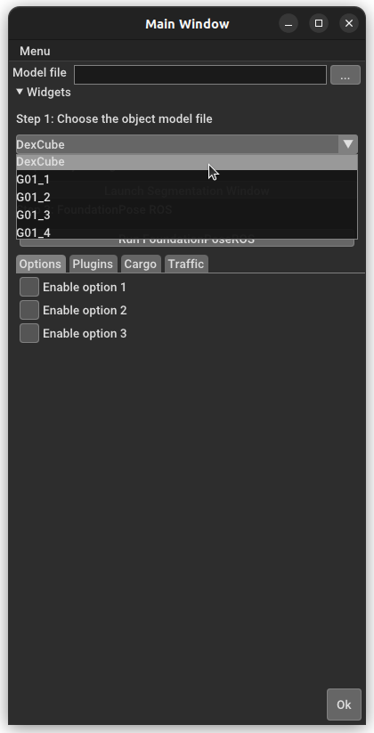
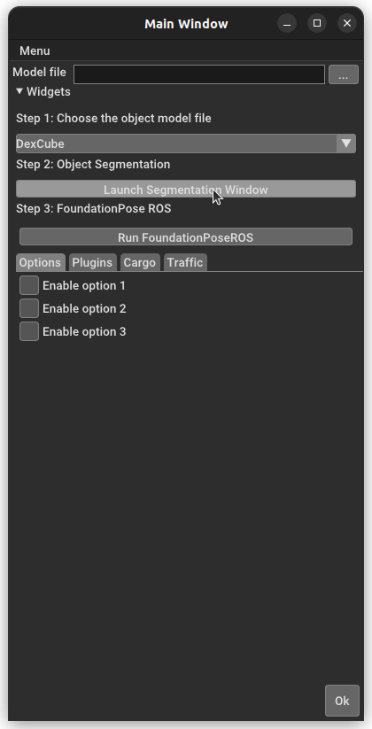
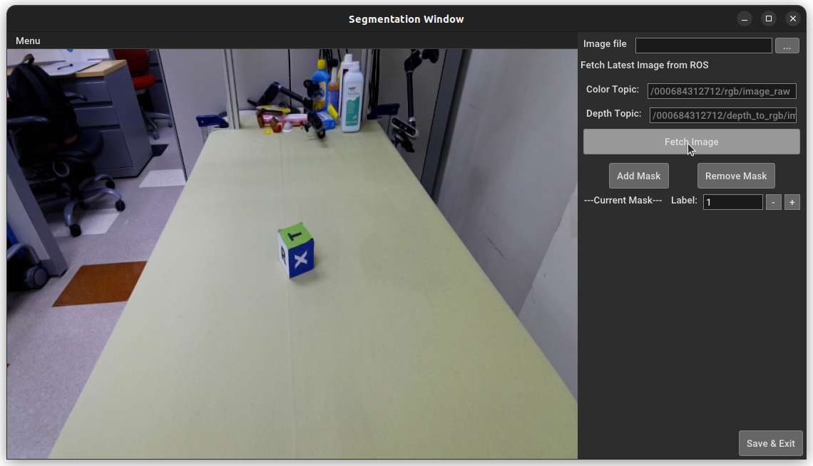
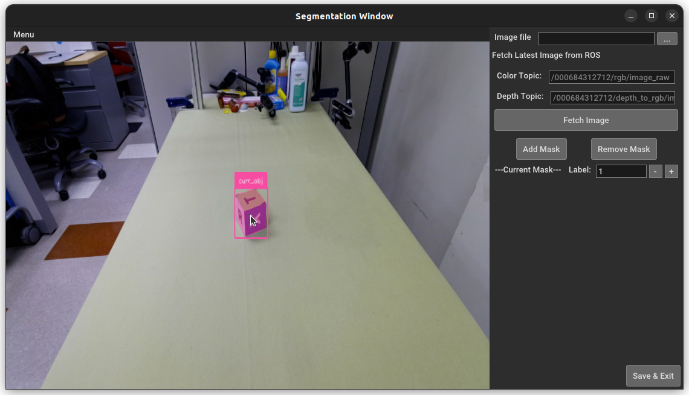
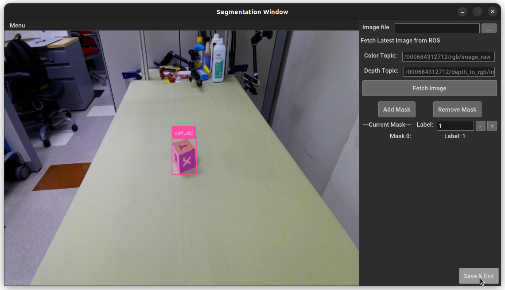

# FoundationPoseROS

## Overview

FoundationPoseROS: A real-time 6D object pose estimation pipeline that integrates SAM2^[1] for segmentation and FoundationPose^[2] for model-based pose estimation, with support for both ROS1 and ROS2 systems.

## Contents

- [FoundationPoseROS](#foundationposeros)
  - [Overview](#overview)
  - [Contents](#contents)
  - [Environment Setup](#environment-setup)
    - [1. Container Setup (ROS1)](#1-container-setup-ros1)
    - [2. Conda Environment Setup (ROS1)](#2-conda-environment-setup-ros1)
  - [Usage (ROS1)](#usage-ros1)
    - [1. Launch the FoundationPoseROS Node](#1-launch-the-foundationposeros-node)
        - [Method 1: Launch with initial images:](#method-1-launch-with-initial-images)
        - [Method 2: Launch with initial pose:](#method-2-launch-with-initial-pose)
        - [Method 3: Launch with control Panel:](#method-3-launch-with-control-panel)
    - [2. Demo of Control Panel](#2-demo-of-control-panel)
  - [License](#license)
  - [Acknowledgements](#acknowledgements)
  - [References](#references)

## Environment Setup

### 1. Container Setup (ROS1)

Follow the instructions in the [Container_Installation.md](./docker/container_installation.md) to build & run the container.

### 2. Conda Environment Setup (ROS1)

- Run and Enter the container:

```bash
# run the container
bash docker/container_handler.sh run ros1

# enter the container
bash docker/container_handler.sh enter ros1
```

- Create the conda environment:

```bash
conda create --prefix $PWD/env python=3.10 -y

conda activate $PWD/env
```

- Install PyTorch:

```bash
python -m pip install torch==2.5.1 torchvision==0.20.1 --index-url https://download.pytorch.org/whl/cu118 --no-cache-dir
```

- Install dependencies:

```bash
python -m pip install -r requirements.txt --no-cache-dir
```

- Install RosPoseToolkit:

```bash
python -m pip install -e source/RosPoseToolkit --no-cache-dir
```

- Install FoundationPose:

```bash
# Install FoundationPose
bash scripts/install_foundationpose.sh

# Download checkpoint
bash scripts/download_models.sh --foundationpose
```

- Download SAM2 models:

```bash
wget https://github.com/ultralytics/assets/releases/download/v8.3.0/sam2.1_t.pt --O ./checkpoints/sam2.1_t.pt
```

## Usage (ROS1)

### 1. Launch the FoundationPoseROS Node

The FoundationPoseROS node can be launched in three different ways. The first two methods are for launching the node directly, while the third method is for launching the control panel to assist in segmentation and pose estimation.

Two topics will be published by the FoundationPoseROS node:

- `/fd_pose/track/pose`: The estimated 6D pose of the object in the camera frame.
- `/fd_pose/debug/image_raw`: The debug image with the estimated pose and 3D bounding box.

##### Method 1: Launch with initial images:

Required initial images: `color_image, depth_image, mask_image`

```bash
python tools/run_foundation_pose_node.py \
  --mesh_file ./assets/Objects/DexCube/model.obj \
  --color_topic /000684312712/rgb/image_raw \
  --depth_topic /000684312712/depth_to_rgb/image_raw \
  --init_color ./recordings/ros/ros_image_color.jpg \
  --init_depth ./recordings/ros/ros_image_depth.png \
  --init_mask ./recordings/ros/ros_image_mask.png
```

##### Method 2: Launch with initial pose:

Required initial pose order: `qx qy qz qw tx ty tz`.

```bash
python tools/run_foundation_pose_node.py \
  --mesh_file ./assets/Objects/DexCube/model.obj \
  --color_topic /000684312712/rgb/image_raw \
  --depth_topic /000684312712/depth_to_rgb/image_raw \
  --init_pose 0.2903384383931105 -0.18059155948831976 -0.07861267874288347 0.9364348798296481 0.009255864657461643 -0.0017767383251339197 0.610579252243042
```

##### Method 3: Launch with control Panel:

```bash
python tools/run_foundation_pose_panel.py \
  --color_topic /000684312712/rgb/image_raw \
  --depth_topic /000684312712/depth_to_rgb/image_raw
```

- Step1: Select the target Object Mesh
  
- Step2: Launch the SegmentationWindow and segment the object
  
- Step2-1: Fetch images from ROS topic
  
- Step2-2: Segment the object
  - `ctr + left click` to add positive points
  - `shift + right click` to add negative points
    
- Step2-3: Add the mask image
  
- Step2-4: Save the mask image and exit the segmentation window
  
- Step3: Run the FoundationPose Node
  

### 2. Demo of Control Panel


## License

This project uses multiple licenses:

- All original code in this repository is released under the [MIT License](LICENSE).
- Code derived from [FoundationPose](https://github.com/NVlabs/FoundationPose) is subject to the **NVIDIA Source Code License (© 2024 NVIDIA Corporation)**.

## Acknowledgements

This project includes and modifies code from [FoundationPose](https://github.com/NVlabs/FoundationPose) in the [wrapper](./source/RosPoseToolkit/pose_toolkit/wrappers/foundationpose.py) code, which is licensed under the NVIDIA Source Code License (© 2024 NVIDIA Corporation). The original source code is available at: https://github.com/NVlabs/FoundationPose

Modifications include:

- Added support for `prev_pose` input to `track_one`.
- Added `init_ob_pos_center` input to `register`.
- Exposed parameters `rotation_grid_min_n_views` and `rotation_grid_inplane_step` at initialization.

## References

[1] SAM2:

```bibtex
@article{ravi2024sam2,
  title={SAM 2: Segment Anything in Images and Videos},
  author={Ravi, Nikhila and Gabeur, Valentin and Hu, Yuan-Ting and Hu, Ronghang and Ryali, Chaitanya and Ma, Tengyu and Khedr, Haitham and R{\"a}dle, Roman and Rolland, Chloe and Gustafson, Laura and Mintun, Eric and Pan, Junting and Alwala, Kalyan Vasudev and Carion, Nicolas and Wu, Chao-Yuan and Girshick, Ross and Doll{\'a}r, Piotr and Feichtenhofer, Christoph},
  journal={arXiv preprint arXiv:2408.00714},
  url={https://arxiv.org/abs/2408.00714},
  year={2024}
}
```

[2] FoundationPose:

```bibtex
@InProceedings{foundationposewen2024,
author        = {Bowen Wen, Wei Yang, Jan Kautz, Stan Birchfield},
title         = {{FoundationPose}: Unified 6D Pose Estimation and Tracking of Novel Objects},
booktitle     = {CVPR},
year          = {2024},
}
```
